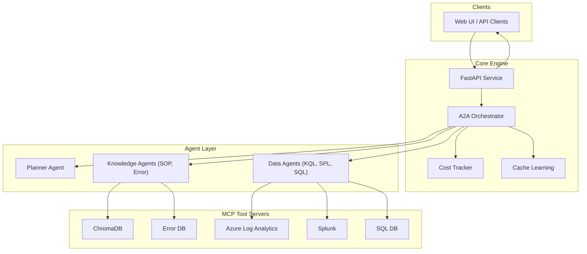
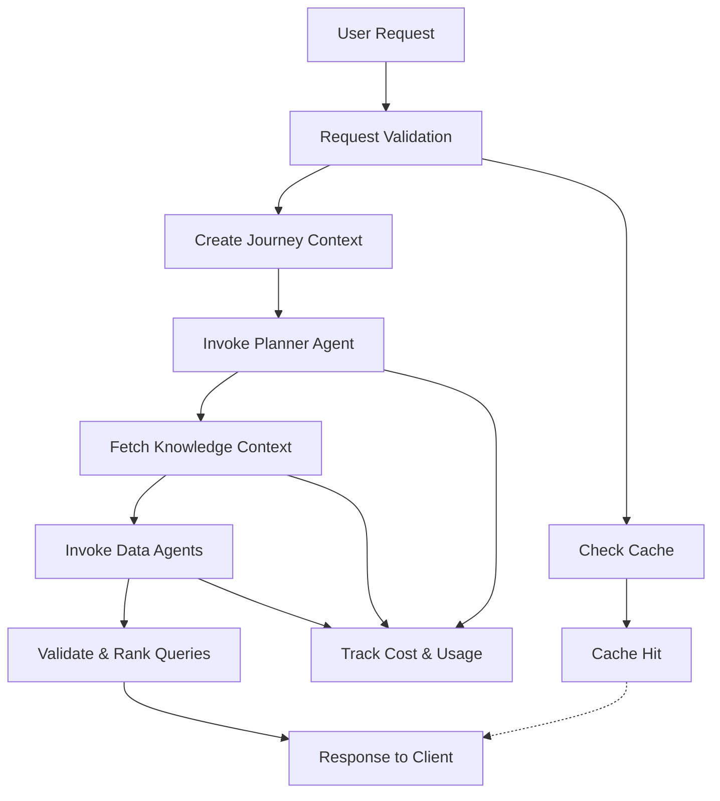
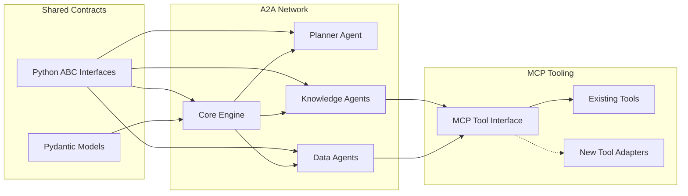
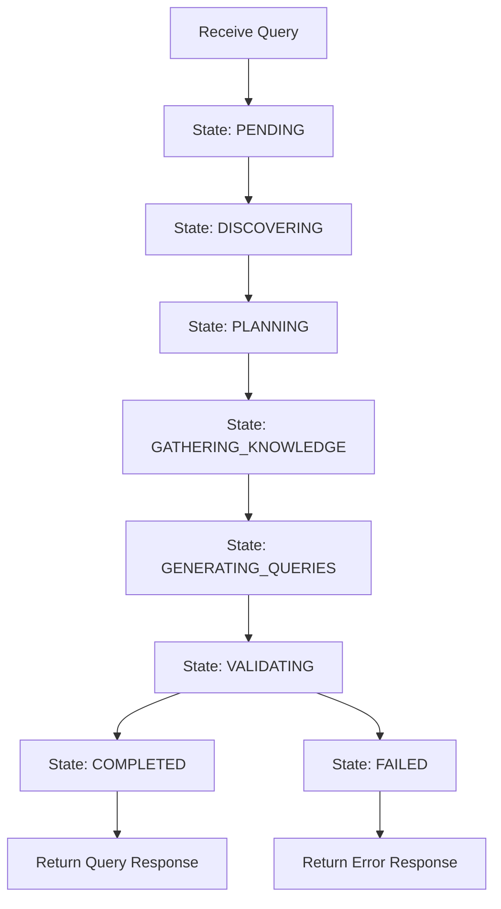
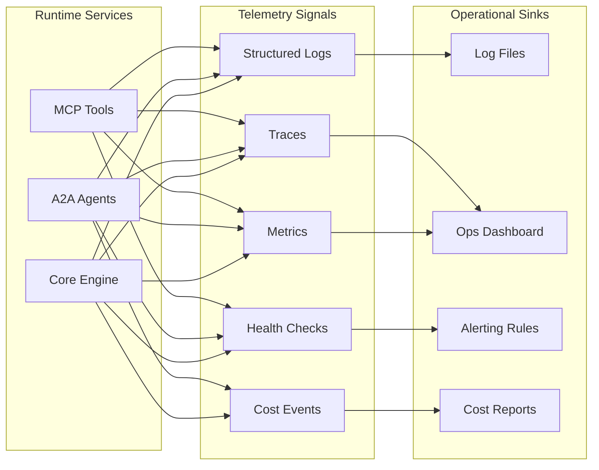

# LexiQuery System Architecture

This document provides a structured view of the LexiQuery Phase 2 architecture using five focused diagrams: high-level architecture, data flow, component connectivity and extensibility, data processing flow, and observability.

## High-Level Architecture

## Data Flow Diagram

## Component Connections and Extensibility

## Data Processing Flow

## Observability and Operations

## Notes

- Agents communicate via A2A protocol using shared interfaces and models.
- MCP tool servers provide platform-specific access (log analytics, vector DBs, SQL).
- Cost tracking aggregates usage per journey, per service, and per model.
- Observability is structured around logs, metrics, traces, and health endpoints.
